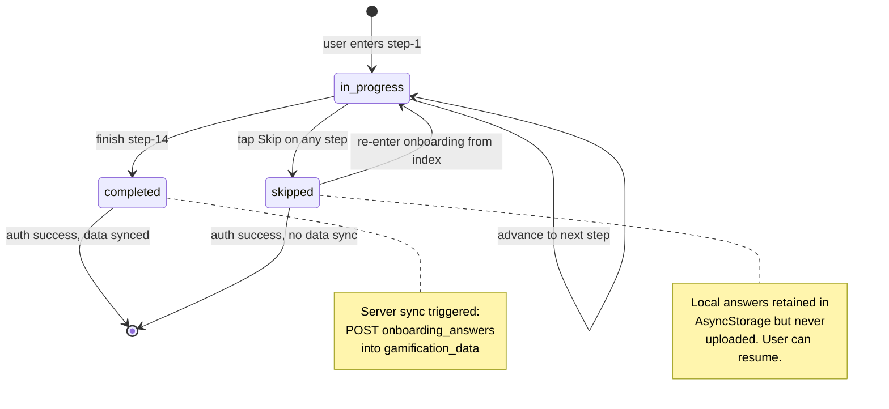
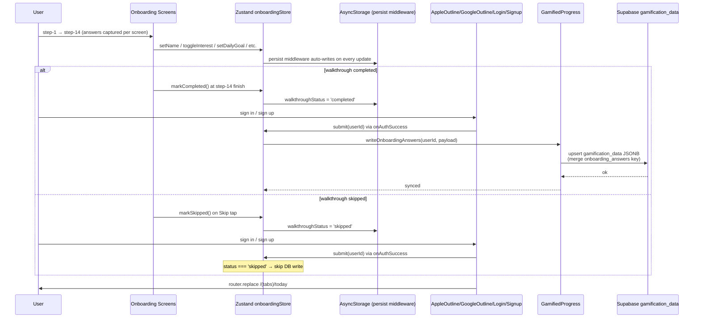
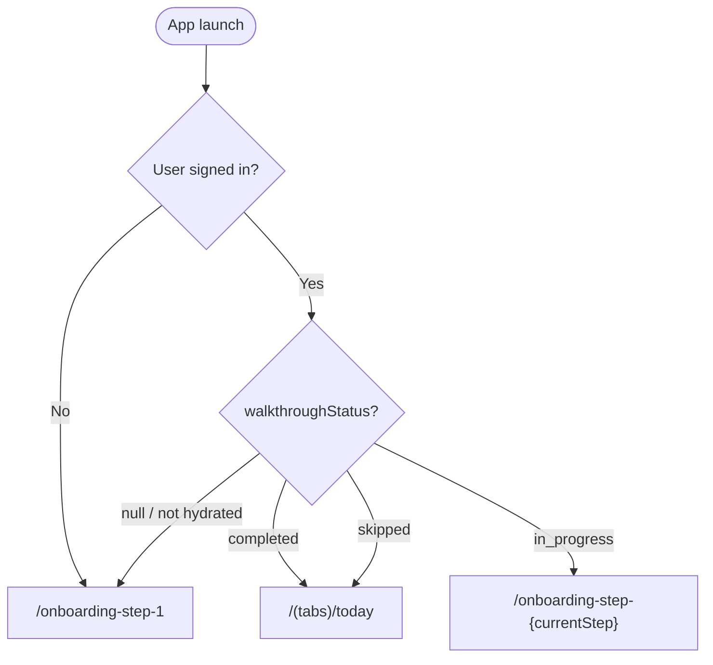

# AFF-786 — Onboarding Data Sync Architecture

> Status: Proposal · Phase 2
> Last updated: 2026-04-21

TL;DR — Legacy onboarding saves answers to AsyncStorage only and never syncs to the server, so the server has zero personalization data and answers evaporate on reinstall. This doc proposes a walkthrough-status flag + conditional sync via the existing `gamification_data` JSONB table, so completed onboarding answers reach the server while skipped sessions stay local.

---

## 1. Current legacy state

### 1.1 What the 4 question screens collect

| Screen | AsyncStorage key | Data |
|--------|------------------|------|
| `onboarding-question-1.tsx:84` | `onboarding_q1_answer` | Knowledge level (5 options) |
| `onboarding-question-2.tsx:83` | `onboarding_q2_answer` | Daily learning goal (5–20 min/day) |
| `onboarding-question-3.tsx:117` | `onboarding_q3_answer` | Notification preference + permission |
| `onboarding-question-4.tsx:101` | `onboarding_q4_answer` | Learning motivation (multi-select) |

Progressive save — each answer is written to AsyncStorage on CONTINUE tap before navigation, no batched commit.

### 1.2 Where the data lives

- **AsyncStorage only** — no Supabase writes anywhere in the 4 question files.
- `onboarding_completed` flag is set at `onboarding-question-4.tsx:105` when Q4 finishes. Not read by routing.
- `archives-auth.tsx` auth success (`:111–117`) does **not** upload AsyncStorage answers to the server.

### 1.3 Consequences

- Server has zero personalization signal → recommendations can't be tailored.
- Reinstall or cache clear → answers gone forever.
- Same user on a new device starts from zero.
- `onboarding_completed` exists but is effectively dead — it can't gate routing because it's not checked anywhere meaningful.

---

## 2. New flow goals

1. Track whether the walkthrough was **completed** (all 14 steps done) or **skipped** (user hit a Skip button partway through).
2. On successful auth, **conditionally** push collected answers to the server.
3. Reuse the existing `gamification_data` JSONB cloud sync infrastructure — no new table.
4. Optionally gate routing so a logged-in user who hasn't finished the walkthrough resumes where they left off.

---

## 3. Walkthrough status state machine



### 3.1 Transitions

| From | Event | To | Side effect |
|------|-------|----|----|
| `[initial]` | Store hydrate, no prior state | `in_progress` | — |
| `in_progress` | User taps Skip (step-3, step-5, step-8, etc.) | `skipped` | — |
| `in_progress` | User completes step-14 finish screen | `completed` | — |
| `skipped` | User navigates back to step-1 | `in_progress` | Reset timestamps, keep prior answers |
| `completed` | Auth success | `[terminal]` | **Server sync fires** |
| `skipped` | Auth success | `[terminal]` | No sync, local data retained |

---

## 4. End-to-end flow diagram



---

## 5. Data shape

### 5.1 Zustand store extensions

```ts
type WalkthroughStatus = 'in_progress' | 'completed' | 'skipped';

interface OnboardingState {
  // Existing
  name: string;
  interests: InterestKey[];
  currentStep: number;
  totalSteps: number;

  // New answer fields (from steps 8/10)
  dailyGoalMinutes: 5 | 10 | 15 | 20 | null;
  ageGroup: '13-17' | '18-24' | '25-34' | '35-44' | '45+' | null;
  knowledgeLevel: 'new' | 'beginner' | 'intermediate' | 'advanced' | null;

  // Flag
  walkthroughStatus: WalkthroughStatus;

  // Actions
  markCompleted: () => void;
  markSkipped: () => void;
  submit: (userId: string) => Promise<void>;
}
```

### 5.2 Persist middleware

Use `zustand/middleware/persist` with AsyncStorage:

```ts
persist(
  (set, get) => ({ ...state, ...actions }),
  {
    name: 'onboarding_v2_state',
    storage: createJSONStorage(() => AsyncStorage),
    partialize: (state) => ({
      // Don't persist currentStep — always resume from walkthroughStatus
      name: state.name,
      interests: state.interests,
      dailyGoalMinutes: state.dailyGoalMinutes,
      ageGroup: state.ageGroup,
      knowledgeLevel: state.knowledgeLevel,
      walkthroughStatus: state.walkthroughStatus,
    }),
  },
)
```

### 5.3 Server payload

Merge into `gamification_data` row's JSONB column at key `onboarding_answers`:

```json
{
  "newProgress": [ /* existing era progress */ ],
  "era_xp": { /* existing */ },

  "onboarding_answers": {
    "version": 2,
    "name": "Ahmed",
    "interests": ["heritage", "productive"],
    "daily_goal_minutes": 10,
    "age_group": "25-34",
    "knowledge_level": "intermediate",
    "completed_at": "2026-04-21T17:30:00Z"
  }
}
```

Write path goes through `GamifiedProgress` to reuse the existing debounced 2s cloud sync infrastructure. No new Supabase client call needed in onboarding code.

---

## 6. Routing guard (optional but recommended)

### 6.1 Decision tree at `app/index.tsx`



Rationale for `skipped → Today`: user consciously bypassed walkthrough, don't block app access. Only `in_progress` without explicit skip means the user was mid-flow and should resume.

### 6.2 Implementation note

Wait for Zustand hydration before reading `walkthroughStatus` — `persist` middleware has an `onRehydrateStorage` callback or `hasHydrated()` helper. Show a splash / loading state until hydrated to avoid false routing.

---

## 7. Implementation checklist

- [ ] Add `persist` middleware + new answer fields + `walkthroughStatus` to `stores/onboardingStore.ts`
- [ ] Implement `submit(userId)` via `GamifiedProgress.writeOnboardingAnswers()` (new method on the engine)
- [ ] Extend `GamifiedProgress` to accept `onboarding_answers` merge-write into the JSONB doc
- [ ] Wire `markCompleted()` on the step-14 finish screen (when built)
- [ ] Wire `markSkipped()` on every Skip button (`OnboardingHeader.onSkip`, step-2 "I already have an account", etc.)
- [ ] Call `submit(userId)` inside `onAuthSuccess` of:
  - `AppleOutlineButton` (via step-7)
  - `GoogleOutlineButton` (via step-7)
  - `onboarding-login.tsx` `signInUser`
  - `onboarding-signup.tsx` `signUpUser`
- [ ] Add routing guard to `app/index.tsx` (optional, see §6)
- [ ] Add migration: if legacy `onboarding_q*_answer` keys exist in AsyncStorage, seed the new store once (optional — most users will restart fresh)

---

## 8. Open questions

1. **Anonymous sync** — should we upload answers pre-auth under an anonymous ID and associate on sign-in? Simpler to skip and just require auth; matches legacy behavior where data is useless pre-auth anyway.
2. **Skipped users re-entering later** — if a skipped user later taps some in-app prompt to "finish your profile", how do they resume? Proposed: reset status to `in_progress` and `router.push('/onboarding-step-3')`.
3. **Incomplete submit on auth** — if `submit()` fails (network), retry how? Queue via `GamifiedProgress`'s existing retry path, or surface error to user?
4. **Versioning** — the proposed payload has a `version: 2` field. If we change the shape later, how do we migrate existing rows? Probably handle in the read path (read-time migration).
5. **Deprecation of legacy email-details / archives-auth** — these still exist and still run the legacy no-sync auth flow. When do they get removed? Blocking on the new flow reaching full coverage.

---

## 9. Legacy vs new comparison

| Aspect | Legacy | Proposed new |
|--------|--------|--------------|
| Where answers live | AsyncStorage only | AsyncStorage (local) + `gamification_data.onboarding_answers` (cloud if completed) |
| When saved locally | Per-question on CONTINUE | On every field change (Zustand persist) |
| When synced to server | Never | On auth success, if `walkthroughStatus === 'completed'` |
| "Completed" flag | `onboarding_completed` in AsyncStorage | `walkthroughStatus` in Zustand + AsyncStorage |
| Routing guard | None | Optional check in `app/index.tsx` |
| Skip path | Jumps to auth, no flag | `markSkipped()` → `walkthroughStatus = 'skipped'` |
| Resume support | None | `currentStep` + `walkthroughStatus === 'in_progress'` |
| Reinstall survival | No | Yes, if completed before |
